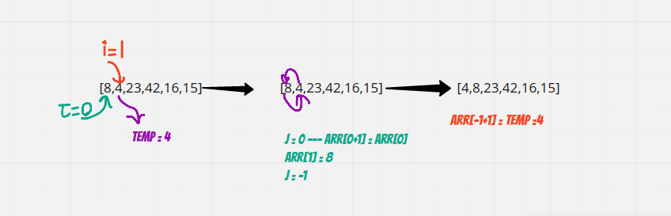
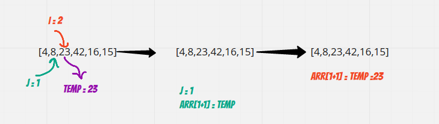
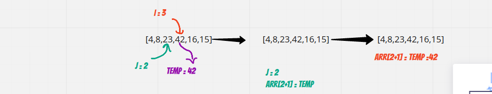
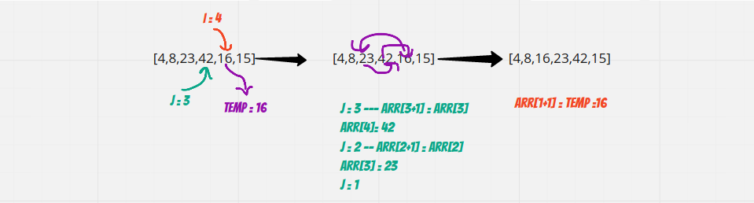
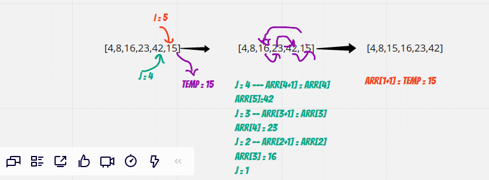

# The insertion sort

- Insertion Sort is a sorting algorithm that traverses the array multiple times as it slowly builds out the sorting sequence.
- The traversal keeps track of the largest value and places it in the front of the array which should be sorted in descending order.

## Pseudocode

`InsertionSort(int[] arr)`

 `FOR i = 1 to arr.length`
  `int j <-- i - 1`
  `int temp <-- arr[i]`

  `WHILE j >= 0 AND temp < arr[j]`
        `arr[j + 1] <-- arr[j]`
        `j <-- j - 1`

   `arr[j + 1] <-- temp`

## Trace

- Sample Array: `[8,4,23,42,16,15]`

### Pass 1

- In the first pass through of the insertion sort,The temp value gets updated to remember the value at the current index .
- We evaluate if the value at index j (i-1) is larger than what is currently present in index i.
- We find this larger number right away in index 0.  
- The current value at index i is being updated with the previous value.
- The j index become the index before what is currently j index refer to.
- At the end of the evaluation, the larger number will be swapped with the current value in index i.

### Pass 2

- In the second pass through of the insertion sort,The temp value gets updated to remember the value at the current index .
- We evaluate if the value at index j (i-1) is larger than what is currently present in index i.
- The current value at index i is not smaller than the previuos value.
- The order won't change in this case.

### Pass 3

- In the third pass through of the insertion sort,The temp value gets updated to remember the value at the current index .
- We evaluate if the value at index j (i-1) is larger than what is currently present in index i.
- The current value at index i is not smaller than the previuos value.
- The order won't change in this case.

### Pass 4

- In the fourth pass through of the insertion sort,The temp value gets updated to remember the value at the current index .
- We evaluate if the value at index j (i-1) is larger than what is currently present in index i.
- We find this larger number right away in index 3 and 2.  
- The current value at index i is being updated with the previous value.
- The j index become the index before what is currently j index refer to.
- At the end of the evaluation, the larger number will be swapped with the current value in index i.

### Pass 5

- In the fourth pass through of the insertion sort,The temp value gets updated to remember the value at the current index .
- We evaluate if the value at index j (i-1) is larger than what is currently present in index i.
- We find this larger number right away in index 4 and 3 and 2.  
- The current value at index i is being updated with the previous value.
- The j index become the index before what is currently j index refer to.
- At the end of the evaluation, the larger number will be swapped with the current value in index i.

- After this iteration, i will stop at 5, forcing it to break out of the outer for loop and leaving our array now sorted.

### Efficency

- Time: O(n^2)
  - The basic operation of this algorithm is comparison.
  - This will happen n * (n-1) number of times --- concluding the algorithm to be n squared.

- Space: O(1)
  - No additional space is being created.
  - This array is being sorted in place -- keeping the space at constant O(1).
