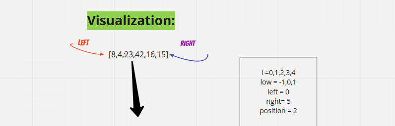
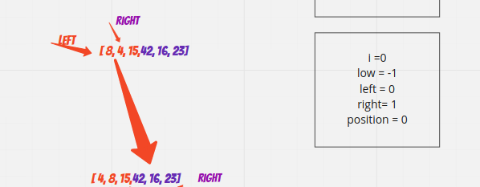
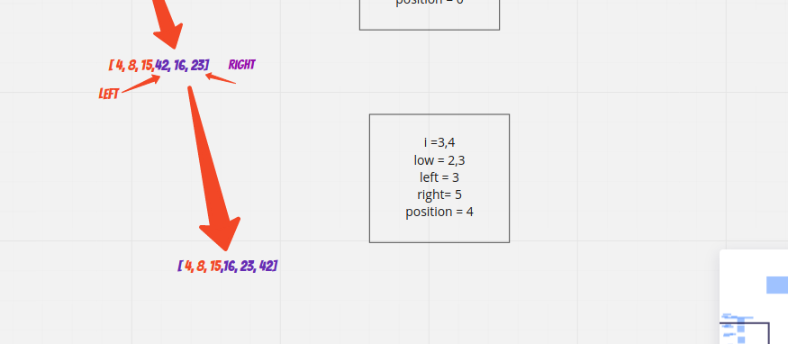

# The Quick sort

- QuickSort is a sorting algorithm that split the array into left and right array according to the pivot value and sort them then merge them in ascending order.

## Pseudocode

`ALGORITHM QuickSort(arr, left, right)`
    `if left < right`
        `// Partition the array by setting the position of the pivot value`
        `DEFINE position <-- Partition(arr, left, right)`
        `// Sort the left`
        `QuickSort(arr, left, position - 1)`
        `// Sort the right`
        `QuickSort(arr, position + 1, right)`

## Trace

- Sample Array: `[8,4,23,42,16,15]`

- Partitioning and swaping .

 

 

### Time complexity of Merge Sort is  O(nLogn)

### Space complexity of Merge sort is O(1) as requires an additional memory space for the temp array
